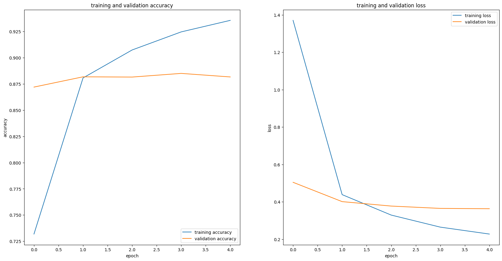
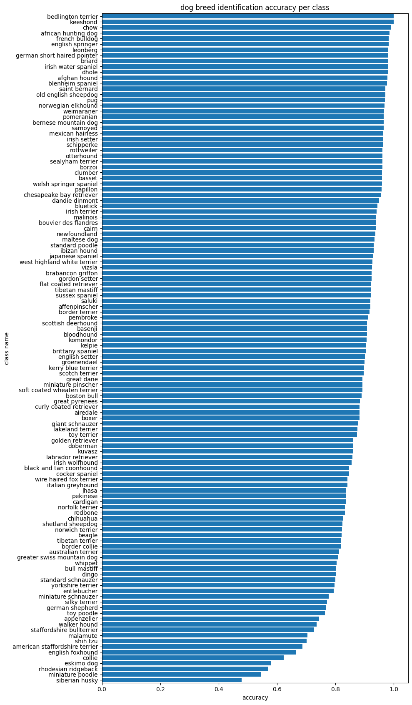
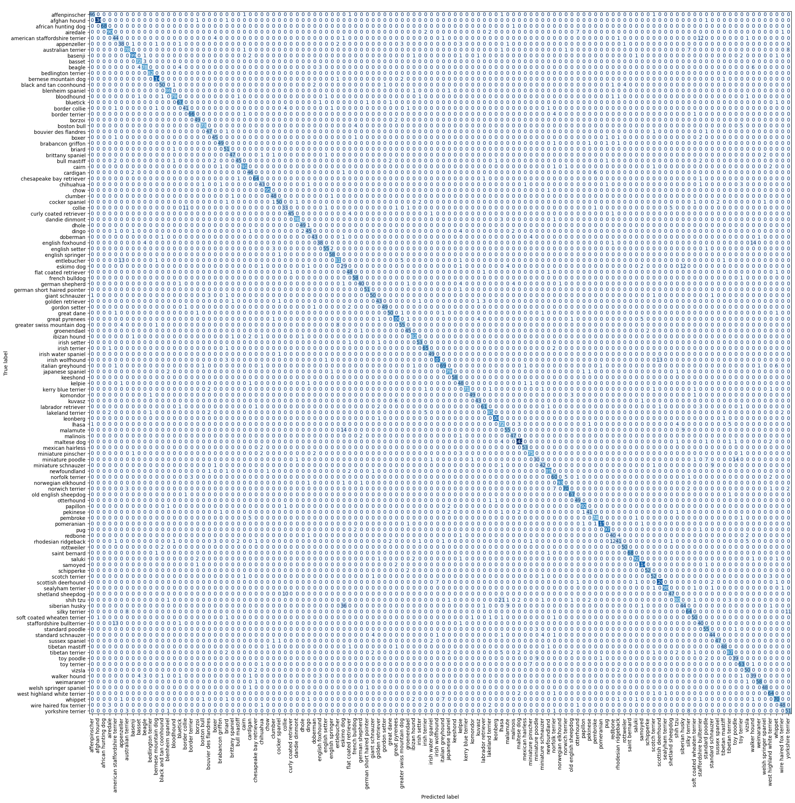

# Dog Breed Identification

This repository contains two notebooks for dog-breed classification using CNNs and transfer learning.  
- **Primary goal (notebook 1):** solve the [Kaggle Dog Breed Identification competition](https://www.kaggle.com/c/dog-breed-identification).  
- **Secondary goal (notebook 2):** produce a model & demo hosted on [Hugging Face Spaces](https://huggingface.co/spaces/JankData/dog-breed-identification-classification).

Both notebooks share a similar overall pipeline (image preprocessing, augmentation, transfer learning, classifier head, training/early stopping, evaluation), but they differ in dataset source and packaging for deployment.

---

## Repository structure
- `dog_breed_id.ipynb` — original notebook (Kaggle-focused).  
  - Includes the Kaggle submission file `full_model_predictions_resnetv2_1.csv`.  
  - **Public leaderboard (submission): log loss 1.02864**.
- `dog_breed_id_version2.ipynb` — second notebook (version2) intended for hosting on Hugging Face Spaces.  
  - Uses the Stanford ImageNet Dogs dataset (link below).  
  - Contains code and assets used to create the Hugging Face Space demo.

---

## images in `results/`

Training / validation accuracy & loss:  


Per-class accuracy:  


Confusion matrix:  


---

## Datasets used
- **Kaggle Dog Breed Identification dataset** — used for the competition-focused notebook.  
  (Original Kaggle competition: https://www.kaggle.com/c/dog-breed-identification)
- **Stanford ImageNet Dogs** — used in `dog_breed_id_version2.ipynb` and for the Hugging Face demo:  
  http://vision.stanford.edu/aditya86/ImageNetDogs/  
  These two datasets are very similar and have substantial overlap; `version2` demonstrates training/evaluation on the Stanford dataset and packaging for a model demo.

---

## What changed between notebooks
- **Notebook 1 (`dog_breed_id.ipynb`)**
  - Focus: compete on Kaggle.
  - Dataset: Kaggle competition dataset.
  - Deliverables: Kaggle submission CSV and exploration notebook.
  - Result: submission with log loss **1.02864**.

- **Notebook 2 (`dog_breed_id_version2.ipynb`)**
  - Focus: reproducibility + hosting a model demo on Hugging Face Spaces.
  - Dataset: Stanford ImageNet Dogs (cleaned / reformatted for the demo).
  - Extra outputs: plots and artifacts saved to `results/` (training curves, per-class accuracy, confusion matrix).
  - Packaging: model + preprocessing saved in a format suitable for inference in the Hugging Face Space linked above.

---

## Approach
- Data loading, cleaning and class mapping.  
- Image preprocessing and augmentation.  
- Transfer learning using a modern CNN backbone.  
- A classification head (dense layers → softmax) for the 120 dog classes.  
- Training with early stopping and checkpointing; model evaluation using accuracy, per-class metrics, and confusion matrix.  
- For the demo notebook the model and minimal inference code are prepared for the Hugging Face space.

See each notebook for code cells that show exact model architecture, hyperparameters, augmentation pipeline, and training logs.

---

## Requirements & environment
Notebook development was done in **Google Colab** (TensorFlow 2.x). To run locally, the following packages are recommended:

```bash
pip install tensorflow tensorflow-hub matplotlib pandas numpy scikit-learn pillow seaborn jupyterlab
```
